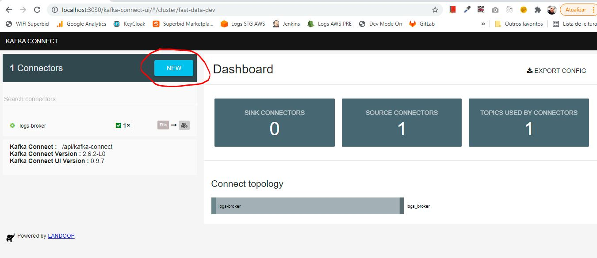

# Introduction

The main purpose of this example is to send a JSON message format to a kafka topic which one will be consumed by Kafka Connector Sink.
Elasticsearch Sink(Kafka Connector) will be consuming the message and it will persist at elasticsearch.

## Stack
- Spring Boot
- Docker/Docker Compose
- Lenses Box(Apache Kafka docker image for developers)
  - Kafka Broker
  - [Kafka Connect(ElasticsearchSinkConnector)](https://docs.confluent.io/kafka-connect-elasticsearch/current/index.html)
- Elasticsearch OSS 7.10.2
- Kibana OSS 7.10.2
- Dejavu 3.4.7

## Docker

Kafka, Elasticsearch and Elasticsearch Browser Viewers will be running by Docker Compose.

Run docker-compose.yml file:
```
docker-compose up -d
```

## Creating Kafka Topic

Enter at docker kafka container
```
docker run --rm -it --net=host landoop/fast-data-dev:latest bash
```


Create kafka topic called test
```
kafka-topics --create --topic test --partitions 3 --replication-factor 1 --zookeeper 127.0.0.1:2181
```


Access Kafka Connect UI
```
http://localhost:3030/kafka-topics-ui/#/
```

Click at test topic


The topic has not any message yet


2 - Start Java Project(Kafka Producer)

This project will send a message to kafka topic

Build the project:

```
mvn clean install
```

Start the app

```
java -jar target\demo-springboot-kafka-connect-0.0.1-SNAPSHOT.jar
``` 


Call rest endpoint api which one is goind to send message to kafka topic
```
curl -XPOST http://localhost:8080/dispatch-topic-message
```


Access Kafka Connect UI
```
http://localhost:3030/kafka-topics-ui/#/
```

Click at test topic


The topic received the message!

## Setting Kafka Connect(Elasticsearch Sink)

Now, we´re going to setting elasticsearch connector sink which one will to persist message at elasticsearch

Access Kafka Connect UI and click at New button
 
```
http://localhost:3030/kafka-connect-ui/
```



At search box type 'elasticsearch' and click at Elastic Search Confluent Sink Connector


Now, replace all properties settings by the follow:

```
name=sink-elastic-test-distributed
connector.class=io.confluent.connect.elasticsearch.ElasticsearchSinkConnector
tasks.max=2
topics=test
key.converter=org.apache.kafka.connect.storage.StringConverter
key.converter.schemas.enable=true
value.converter=org.apache.kafka.connect.json.JsonConverter
value.converter.schemas.enable=true
connection.url=http://elasticsearch:9200
type.name=test
topic.key.ignore=true
topic.schema.ignore=true
```


Finally, click at CREATE button.

The Connector called 'sink-elastic-test-distributed' was created!


To see Connector Logs, access Kafka Connect UI url above and click at connect-distributed.log:

```
http://localhost:3030/logs/
```


## Viewing data at elasticsearch

### Dejavu

Dejavu is an elasticsearch browser view.

Access Dejavu
```
http://localhost:1358/
``` 
Type elasticsearch url with port and index which one was created to persist kafka message and click at 'Connect' button


Follow is possible to see the message persisted at elasticsearch index


### Kibana

Kibana is another elasticsearch browser view.

Access Kibana Dev Tools url
```
http://localhost:5601/app/dev_tools#/console
```

Type follow query and press (CTRL+ENTER)
```
GET test/_search
{
  "query": {
    "match_all": {}
  }
}
```


